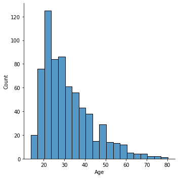

https://www.kaggle.com/datasets/samuelcortinhas/credit-card-approval-clean-data

The general target will be to predict whether someone should be approved for a credit card. Most columns will be relevant, particularly held debt, existing credit score, income, marital status, and employment time. Two columns (Gender and Ethnicity) are included and may have interesting collateral correlations for approvals but should probably not be used for final model predictions for ethical reasons.

 
Age distribution. Data clustered around 25 with a right-skew. Most data is from 20-40. 

 
Debt distribution. Data clustered at 0 with most debt less then 5 thousand in total. Local maximum at 11 thousand. 

 
Work industry of the person in consideration. Energy is the most common. 

 
Ethnicities represented in the dataset. Roughly population-representative with underrepresentation of latino population. 

 
Years the person in consideration has been employed. Clustered at 0. 

 
Credit score (scaled down). Mostly 0--indicating no credit score yet. 

 
Income (Scaled down). Again mostly 0. 
